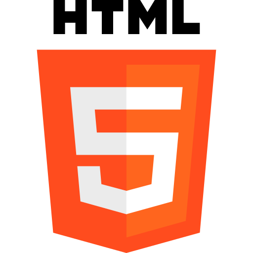
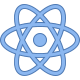

## orionvega2343-cloud

Начинающий Frontend разработчик из Москвы · React / Vite · Learning by building

 

---

## About me / Обо мне

**EN**

- Beginner Frontend developer from Moscow
- Started learning in September 2025
- I like complex algorithms and teamwork
- I learn using YouTube, Stack Overflow, and Claude Code
- I’m looking for a job

**RU**

- Начинающий Frontend разработчик из Москвы
- Начал обучение в сентябре 2025
- Люблю сложные алгоритмы и командную работу
- Учусь с помощью YouTube, Stack Overflow и Claude Code
- Хочу найти работу

---

## Now / Сейчас

**EN**
- Building portfolio projects and improving React fundamentals
- Practice: forms, modals, filters, animations, state management

**RU**
- Делаю проекты в портфолио и усиливаю базу React
- Практика: формы, модалки, фильтры, анимации, управление состоянием

> EN: “Learning sticks when you ship.”
>  
> RU: «Лучше один законченный проект, чем десять начатых».

---

## Languages and tools / Языки и инструменты

  
  
  
  
  
  

  
<b>What I’m comfortable with / Что уже умею</b>

   
  
  - **EN**: components, props, state, forms, basic routing, UI layout, CSS modules  
  - **RU**: компоненты, props, state, формы, базовый роутинг, верстка, CSS-модули

---

## courses table / Таблица обучения

| Period / Период     | Course / Курс | Platform / Платформа |
| ------------------- | ------------- | -------------------- |
| Sep 2025 – Oct 2025 | Figma        | YouTube              |
| Oct 2025 – Jan 2026 | HTML & CSS    | YouTube              |
| Jan 2026 – Mar 2026 | JavaScript    | YouTube              |
| Mar 2026 – present  | React         | YouTube              |

---

## Follow me / Контакты

  
  

  
<b>Open for work / Открыт для предложений</b>

   
  
  - **EN**: I’m looking for a junior frontend role (remote/office).  
  - **RU**: Ищу позицию junior frontend (удаленно/офис).

---

## statistics commit / Статистика

  
  

---

## pinned / Закреплённое

- **FastCraft Store UI** — donation shop UI (filters, modal, animations)
- **ReactStudy** — hooks practice tasks
- **Grades diary** — UI practice (forms, modal, components)

  
<b>Mini roadmap / Мини-план</b>

   
  
  - **EN**: finish 2–3 projects with README + screenshots + demo links  
  - **RU**: завершить 2–3 проекта с README + скриншоты + демо

